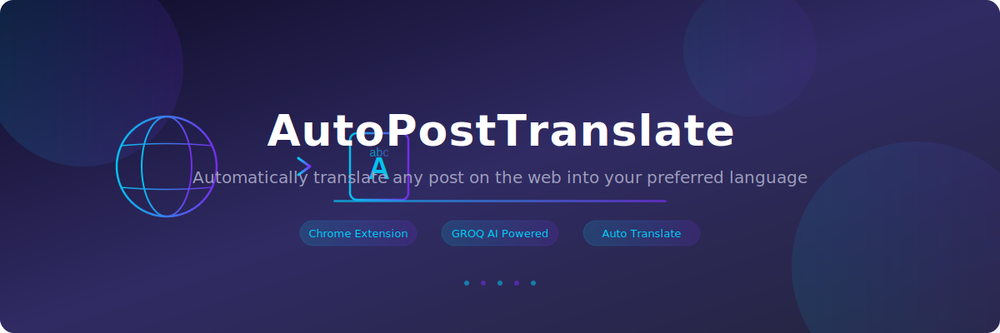

  

  

<h3 align="center">AutoPostTranslate</h3>

  Chrome extension that automatically translates text posts on any webpage into your preferred language. 
  Powered by GROQ AI for fast, accurate translations.

  
  
  

---

## The Problem

[@b_nnett](https://x.com/b_nnett) on X/Twitter asked if there was a Chrome extension to automatically translate posts. Following international content means constantly copy-pasting into Google Translate. A seamless, automatic translator would be a huge time-saver. So we built it — in 2 minutes — with [PlugThis.ai](https://plugthis.ai).

[Original request by @b_nnett](https://x.com/b_nnett/status/2038052929727525133)

## What It Does

- **Automatically translates** text on any webpage — no clicks, no copy-paste
- **Choose your language** via the popup — supports any language
- **Persists preferences** across sessions using Chrome sync storage
- Works on **any website** — Twitter/X, Reddit, news sites, forums, and more

## Install — 30 Seconds, No Build Needed

1. **Download** this repo (Code → Download ZIP) and unzip, or `git clone`
2. Open **`chrome://extensions`** in Chrome
3. Toggle on **Developer Mode** (top-right)
4. Click **Load unpacked** → select the project folder
5. Done. AutoPostTranslate icon appears in your toolbar.

## Setup — 60 Seconds

### 1. Get a Free GROQ API Key

Head to [console.groq.com/keys](https://console.groq.com/keys) and generate a key (it's free).

### 2. Configure the Extension

- Click the **AutoPostTranslate** icon in your toolbar → **Settings**
- Paste your **GROQ API Key**
- Select your **preferred language**
- Hit **Save Configuration**

> **Note:** Never share or commit your real API key.

### 3. Browse and Scroll

Navigate to any webpage. Translations happen automatically. That's it.

---

## How It Works

The extension injects a content script into all webpages. This script identifies text nodes and sends them to the **GROQ AI** API for translation. The translated text replaces the original in-place. User preferences (language, API key) are stored using `chrome.storage.sync` and persist across sessions.

---

## Built with PlugThis.ai

  

This entire extension — UI, background logic, content scripts, translation engine — was generated in **2 minutes** using [**PlugThis.ai**](https://plugthis.ai).

**PlugThis** is the fastest way to build Chrome extensions. Just describe what you want in plain English, and get a working extension back. No code. No setup. No frameworks to learn.

### Lifetime Deal — Starting at $89

We're currently running a **limited lifetime deal**. Pay once, build unlimited extensions forever.

**[Get the Lifetime Deal →](https://plugthis.ai)**

---

### For Developers

If you want to modify the source code, the original source files are in the `source/` directory. After making changes:

1. Replace `YOUR_GROQ_API_KEY_HERE` in `source/.env` with your actual key.
2. Run `npm install && npm run build` from the `source/` directory to rebuild.

## Contributing

PRs welcome.

## License

MIT
